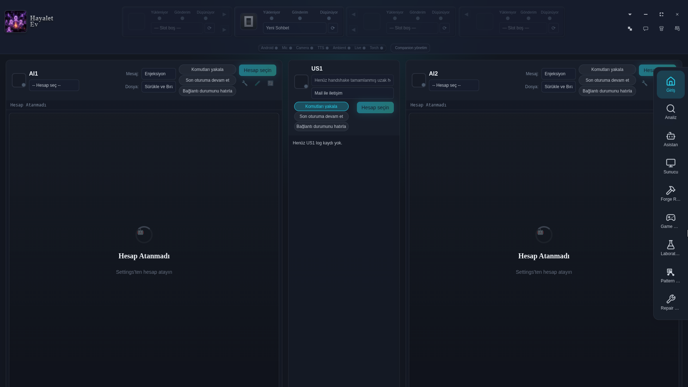
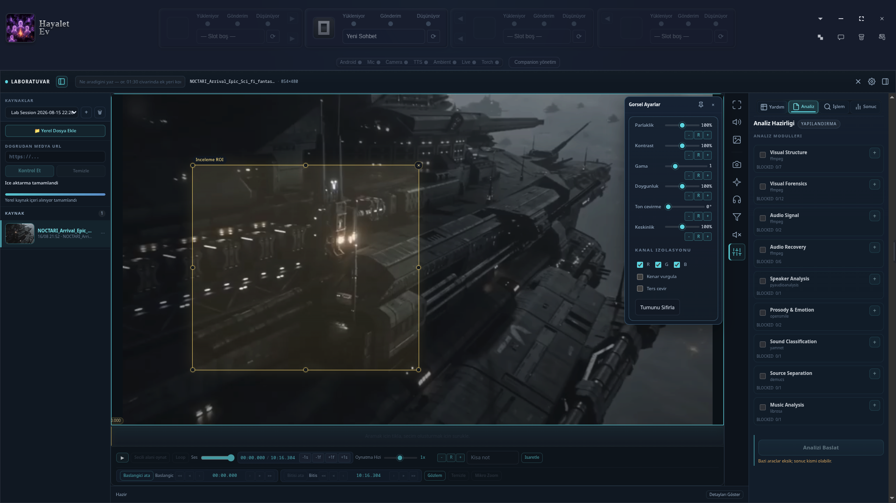
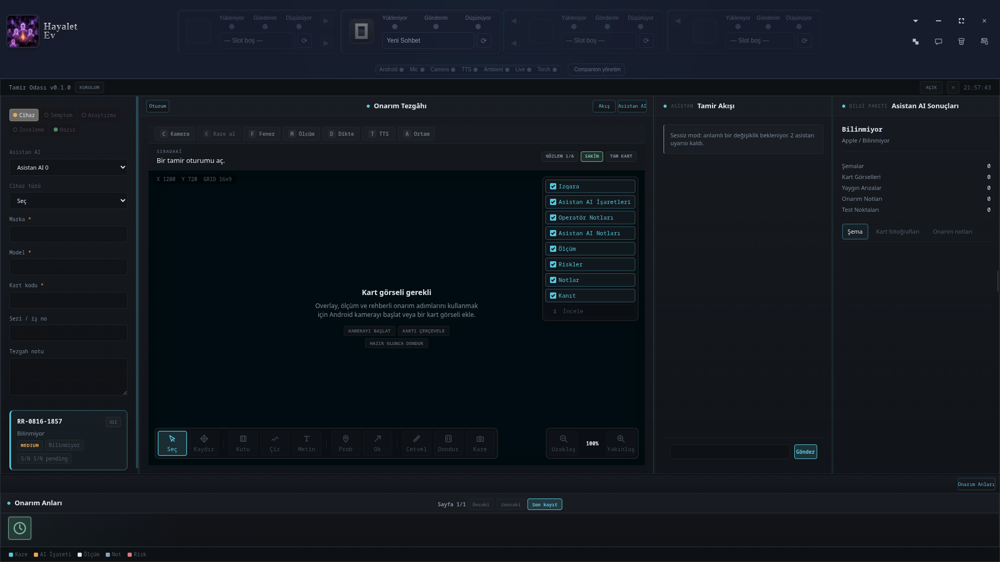
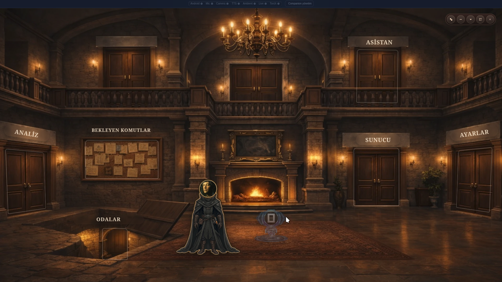

# 👻 Hayalet Ev

Hayalet Ev bir uygulama değil; bir masa, bir alan, bir akış.

İnsan ve yapay zekânın yalnızca konuştuğu değil; birlikte düşündüğü, tartıştığı, araştırdığı, ürettiği, onardığı ve oyun kurduğu yerel bir dijital ortam.

Hayalet Ev'in temel fikri basit:

> **AI'lar yalnızca kullanılan araçlar değil, aynı çalışma alanını paylaşan katılımcılardır.**

Bu fikir, uygulamanın yalnızca sohbet ekranını değil; odalarını, hafızasını, oyunlarını, araştırma akışlarını ve mimarisini belirler.



## 🧠 Hayalet Ev Nedir?

Hayalet Ev, local-first çalışan çok-ajanlı bir çalışma ortamıdır.

Burada farklı AI slotları, insan kullanıcı ve desteklenen uzak kullanıcılar aynı çalışma bağlamının parçaları olabilir.

- **AI1 / AI2** — aynı probleme farklı zihinlerden bakabilen AI katılımcıları.
- **AI0** — yerel araçlara, hafızaya ve çalışma akışlarına erişebilen yardımcı katman.
- **US1** — desteklenen akışlarda başka bir Hayalet Ev kullanıcısına açılan uzak katılımcı.
- **USER** — sistemin dışında duran bir operatör değil, çalışma ortamının doğrudan katılımcısı.

Slotların amacı belirli bir AI ürününü merkeze koymak değildir. Amaç, farklı zihinlerin aynı bağlam üzerinde çalışabilmesini sağlamaktır.

AI slotları; kullanıcının erişebildiği web tabanlı AI oturumlarını, desteklenen harici AI servislerini ve yerel yardımcı/model katmanlarını aynı oda ve çalışma kontratlarına bağlayabilecek şekilde tasarlanır. Bağlantının nereden geldiği değişebilir; Hayalet Ev'in oda, hafıza ve katılımcı modeli aynı kalır.

## 🚧 Proje Durumu

Hayalet Ev aktif geliştirme aşamasındadır. Günlük kullanımda çalışan birçok akış bulunmasına rağmen eksikler, platforma bağlı sorunlar ve henüz keşfedilmemiş hatalar olabilir.

Proje tamamlanmış veya kusursuz bir ürün iddiasıyla değil; kullanılabilen, incelenebilen, değiştirilebilen ve geliştirilmeye açık bir çalışma ortamı olarak paylaşılmaktadır. Kullanırken bulunan sorunların düzeltilmesi, yeni kullanım biçimlerinin denenmesi ve katkılar projenin doğal devamının parçasıdır.

## 🌒 Neden Var?

Klasik AI kullanımı çoğunlukla şöyle çalışır:

```text
insan → prompt → AI → cevap
```

Hayalet Ev bu akışın yeterli olmadığı düşüncesinden doğdu.

Gerçek bir çalışma çoğu zaman tek bir cevaptan oluşmaz: bir fikir ortaya çıkar, biri onu sorgular, başka bir kaynak bulunur, ölçüm yapılır, çelişki çıkar, karar verilir ve sonuç başka bir çalışmaya aktarılır.

Hayalet Ev bu süreci tek tek sohbet pencerelerine bölmek yerine aynı ortamda tutmaya çalışır.

```text
insan
  ↕
AI1 ↔ AI2
  ↕
çalışma alanı
  ↕
kaynaklar / ölçümler / oyunlar / araçlar / hafıza
```

Bu yüzden Hayalet Ev'in asıl ürünü bir chatbot değil, **çalışma ortamıdır**.

## 🏠 Ev Fikri

“Hayalet Ev” yalnızca görsel bir metafor değildir. Uygulamanın yapısı gerçekten bir ev fikrini takip eder:

- **Entrance** — giriş,
- **Analyze** — ortak masa,
- **Rooms** — uzmanlaşmış çalışma alanları,
- **Archives** — hafıza.

Odalar yalnızca uygulama sayfaları değildir; her biri belirli bir iş için kurulmuş çalışma alanıdır.

- Laboratory'de medya incelenir.
- Forge Room'da fikirler iş paketlerine dönüştürülür.
- Repair Room'da fiziksel cihazlarla çalışılır.
- Pattern Room'da araştırma ve belirsizlikler düzenlenir.
- Game Room'da insanlar ve AI'lar aynı oyun kurallarına girer.

Scene Mode ise bu odaları gerçekten bir mekânın parçaları gibi yaşatır.

## ✨ Bugün Neler Yapabiliyor?

Güncel `main` dalında Hayalet Ev yalnızca çoklu-AI sohbeti değildir.

Ana çalışma yüzeyleri:

- AI1, AI2, AI0 ve desteklenen US1 akışları arasında slot tabanlı çalışma,
- kullanıcının mevcut AI oturumlarını ortak slot kontratına taşıyan web tabanlı bağlantı katmanı,
- kalıcı konuşma ve çalışma bağlamları için Archive sistemi,
- bağımsız geliştirilebilen ve `.hevroom` olarak paketlenebilen Room mimarisi,
- medya, görüntü ve ses inceleme/analizi için Laboratory,
- fikirleri görev, cevap, çelişki ve sentez akışına dönüştüren Forge Room,
- elektronik onarım oturumlarını evidence, ölçüm, kamera ve AI desteğiyle birleştiren Repair Room,
- AI ve uzak kullanıcılarla oynanabilen Game Room,
- araştırma materyalini evidence, analysis, interpretation ve uncertainty katmanlarında düzenleyen Pattern Room,
- odaları fiziksel bir mekân gibi sunan Scene Mode,
- kamera, capture ve yerel konuşma özellikleri için Android Companion,
- yerel araçlara ve masaüstü iş akışlarına erişim sağlayan MCP tabanlı yardımcı servisler.

Bazı özellikler FFmpeg, model dosyaları, Android/ADB veya harici AI servisleri gibi ek sistem bileşenleri gerektirebilir.

## 📚 Dokümantasyon

| Alan | Belge |
| --- | --- |
| Oda mimarisi ve paketleme | [rooms/README.md](rooms/README.md) |
| Laboratory | [LABORATORY.md](LABORATORY.md) |
| Forge Room | [FORGEROOM.md](FORGEROOM.md) |
| Repair Room | [REPAIRROOM.md](REPAIRROOM.md) |
| Pattern Room | [PATTERNROOM.md](PATTERNROOM.md) |
| Backgammon / Tavla | [BACKGAMMON.md](BACKGAMMON.md) |
| Team Tetris | [TEAM-TETRIS.md](TEAM-TETRIS.md) |
| Scene Mode | [SCENEMODE.md](SCENEMODE.md) |
| Android Companion | [ANDROIDCOMPANION.md](ANDROIDCOMPANION.md) |
| Güvenlik | [SECURITY.md](SECURITY.md) |

## 🚪 Yerleşik Odalar

| Oda | Durum | Rolü |
| --- | --- | --- |
| Laboratory | Uygulanmış | Medya ve ses kaynaklarını hazırlamak, incelemek, analiz etmek ve bulguları raporlamak |
| Forge Room | Uygulanmış | Belirsiz hedefleri uygulanabilir iş paketlerine dönüştürmek |
| Repair Room | Uygulanmış | Fiziksel elektronik onarım sürecini AI, evidence ve gerçek ölçümlerle aynı oturumda tutmak |
| Game Room | Uygulanmış / gelişiyor | İnsan, AI ve uzak kullanıcıları ortak oyun kurallarında buluşturmak |
| Pattern Room | Prototip / gelişiyor | Kaynak, kanıt, yorum, çelişki ve belirsizlikleri araştırma bağlamında düzenlemek |

Ayrıntılar: [rooms/README.md](rooms/README.md).

## 🧪 Laboratory

Laboratory bir medya oynatıcı değildir. Bir çalışma kaynağını projeye alır, gerekli araçları ve modelleri kontrol eder, medya veya sesi işler, insan incelemesine açar, annotation ve karşılaştırma imkânı sağlar ve sonuçları tekrar kullanılabilir bir çalışma bağlamında tutar.

```text
Kaynak
  ↓
Hazırlık
  ↓
İnceleme
  ↓
Analiz
  ↓
Karşılaştırma / Annotation
  ↓
Rapor / Export
  ↓
AI ile devam
```



Detay: [LABORATORY.md](LABORATORY.md).

## 🔥 Forge Room

Forge Room bir chat ekranı değildir. Belirsiz bir hedefi hedef → preflight → görev taslağı → AI assignment → yanıtlar → çelişkiler → sentez → handoff akışına dönüştürür.

AI cevaplarını nihai karar olarak değil, üretim sürecinin parçaları olarak ele alır.

Detay: [FORGEROOM.md](FORGEROOM.md).

## 🔧 Repair Room

Repair Room elektronik onarım için proje tabanlı bir çalışma tezgâhıdır.

Cihaz bilgisi, semptomlar, riskler, evidence, schematic/datasheet kaynakları, PCB görüntüsü, ölçümler, annotation, timeline, AI sohbeti ve kamera akışları aynı repair session içinde tutulabilir.

> AI önerir, ölçüm doğrular, operatör karar verir; session bütün izi saklar.



Detay: [REPAIRROOM.md](REPAIRROOM.md).

## 🎮 Game Room

Game Room AI'yı yalnızca oyun hakkında konuşan bir yardımcı olmaktan çıkarıp oyunun kurallarına tabi bir katılımcı haline getirir.

### Tavla

Kullanıcı AI1, AI2 veya desteklenen US1 uzak kullanıcısıyla oynayabilir. Legal hamleler host tarafından hesaplanır. AI kendi hamlesini icat etmez; geçerli hamleler arasından seçim yapar.

Detay: [BACKGAMMON.md](BACKGAMMON.md).

### Team Tetris

USER, AI1, AI2 ve US1 dört koltuklu bir takım oyununda aynı motorun içinde yer alabilir. Hidden pair yapısı ve path tabanlı hamleler oyunun mevcut çekirdeğinin parçasıdır.

Detay: [TEAM-TETRIS.md](TEAM-TETRIS.md).

## 🧩 Pattern Room

Pattern Room araştırmayı tek bir “doğru cevap” üretme sürecine indirgemez.

Araştırma materyalini:

- Evidence,
- Analysis,
- Interpretation,
- Uncertainty

katmanlarına ayırır.

Bir yorum kanıt değildir. Bir bağlantı doğrulama değildir. Bir confidence değeri doğruluk puanı değildir. Bir AI cevabı nihai karar değildir.

Detay: [PATTERNROOM.md](PATTERNROOM.md).

## 🎭 Scene Mode

Scene Mode, odaları menü veya kart listesinden çıkarıp Hayalet Ev'in fiziksel mekânına yerleştirir.

Klasik modda bir oda açılır; Scene Mode'da bir odaya gidilir. Koridorlar, kapılar, masalar, hotspot'lar ve yakın görünümler aynı sahne içinde çalışır.



Detay: [SCENEMODE.md](SCENEMODE.md).

## 🧩 Slot Sistemi

Evde herkesin bir yeri vardır:

- **AI1 / AI2** — farklı AI katılımcıları,
- **AI0** — yerel yardımcı katman,
- **US1** — uzak kullanıcı,
- **USER** — çalışma ortamının insan katılımcısı.

Slot sistemi belirli bir AI sağlayıcısına bağımlı olmak için değil, katılımcıları çalışma akışlarından ayırmak için kullanılır.

## 🔄 Akış

Hayalet Ev'de konuşma tek başına son ürün değildir.

```text
konuşma → analiz → karar
fikir → görevler → sentez
medya → inceleme → rapor
onarım → evidence → ölçüm → bulgu
oyun → hamle → durum → sonuç
mesaj → relay → yeni bağlam
```

Bu nedenle çalışma nesneleri ve session'lar önemlidir. Bir iş yalnızca ekranda görünür olduğu sürece değil, tekrar açılabildiği ve bağlamıyla birlikte devam ettirilebildiği sürece yaşar.

## 🧠 Hafıza

Archive sistemi konuşmaları ve çalışma bağlamlarını saklar. Amaç yalnızca log tutmak değil, bir çalışmanın geçmişte ne söylendiğini, hangi bağlamdan geldiğini ve gerektiğinde nereden devam edilebileceğini korumaktır.

## 📱 Android Companion

`android-companion/`, masaüstü Hayalet Ev ile birlikte çalışan yerel Android yardımcı uygulamasıdır.

Güncel akışlarda kamera preview, masaüstünden capture/command, yerel wake-word algılama, çevrimdışı transcription, desteklenen Analyze/Repair akışlarına fotoğraf ve transcript aktarımı ve companion install/update kontrolü kullanılabilir.

Detay: [ANDROIDCOMPANION.md](ANDROIDCOMPANION.md).

## 🧱 Room Mimarisi

Oda kaynakları `rooms/<room-id>` altında kendi manifest, UI, host runtime, protocol, i18n ve asset katmanlarıyla yaşar.

Temel kural:

> **Core odaları keşfeder ve çalıştırır; oda kendi iş alanını sahiplenir.**

Dağıtılabilir oda formatı `.hevroom`'dur.

Kaynak/runtime/storage ayrımı için: [rooms/README.md](rooms/README.md).

## 🤖 Assistant / AI0

AI0, Hayalet Ev'in yerel yardımcı katmanıdır. Araçlara erişebilir, oda protokollerinde görev alabilir ve gerektiğinde çalışma bağlamı veya hafıza üzerinden devreye girebilir.

## 🌐 US1

US1 başka bir Hayalet Ev kullanıcısına açılan bağlantıdır. Desteklenen akışlarda uzak kullanıcı mesajlaşabilir, oyunlara katılabilir ve ortak çalışma bağlamının bir parçası olabilir.

Game Room'daki Tavla ve Team Tetris bunun doğrudan örnekleridir.

Bağlantı ve güvenlik davranışları [SECURITY.md](SECURITY.md) kapsamında ele alınır.

## ⚙️ Mimari

Hayalet Ev'in temel teknik yapısı:

- Electron,
- Vite,
- TypeScript,
- local-first veri yapısı,
- slot tabanlı AI bağlantısı,
- MCP araçları,
- Room tabanlı genişleme mimarisi,
- Android Companion,
- oda sınırlarında yönetilen medya/model/tool bağımlılıkları.

## 🚀 Geliştirici Başlangıcı

Gereksinimler:

- Node.js 22+
- npm 10+

```bash
npm ci
npm run electron:dev
```

Tam kalite kapısı:

```bash
npm run check:all
```

Bazı medya, otomasyon, Android ve model özellikleri ek sistem bağımlılıkları gerektirebilir.
